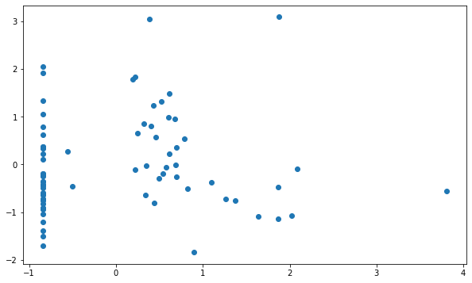
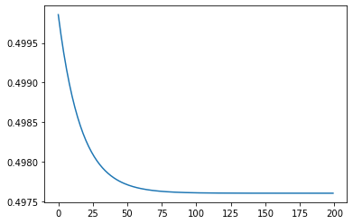
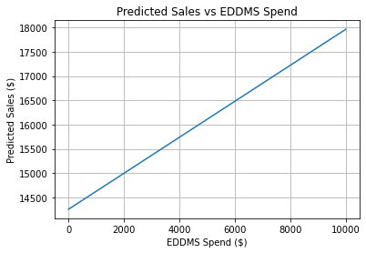
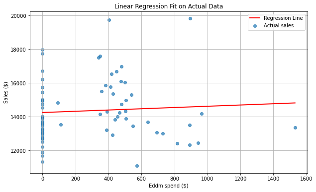

# eddm-effectiveness-analysis
# 📉 Univariate Linear Regression from Scratch: EDDM Spend vs Weekly Sale
This project explores whether Every Door Direct Mail (EDDM) campaigns actually increase sales for a small business. I used real weekly ad spend and sales data from my family's business to implement and validate a univariate linear regression model, entirely from scratch using gradient descent and manual cost function optimization.

---

## Highlights 
- Implemented gradient descent manually
- Normalized input and output data for faster and better convergence
- Visualized the cost function over iterations
- Validated results against scikit-learn’s built-in LinearRegression
- Simulated various ad spend levels to estimate realistic return on investment

---

## Main Insisght
> Even with a $10,000 EDDM ad spend, the model predicts only ~$3,500 in additional sales, a **negative ROI** and potential overspending.

## Project Summary

Using weekly EDDM spend from the USPS and weekly sales data from our POS system, I asked:  
**“Does mailing ads one week actually increase sales the next?”**

### Process:
- I shifted the EDDM spend by 1 week to match potential delayed effect on sales.
- Normalized all values using **z-score normalization** to stabilize gradient descent.
- Implemented my own cost function and updated weights using manual gradient descent.
- Ran multiple tests to explore the effect of learning rate and iteration count on convergence.
- Measured prediction accuracy using a ±15% tolerance — achieving ~80% accuracy.
- Simulated model predictions for a range of EDDM spend to understand cost-effectiveness.

### Validation:
I compared my learned parameters (`w`, `b`) to those returned by `scikit-learn.LinearRegression`, and they were **nearly identical**. This confirmed that my implementation was mathematically correct.

## Visuals
| Title | Description |
|-------|-------------|
|  | Raw data: weekly EDDM spend vs sales |
|  | Cost function over gradient descent iterations |
|  | Predicted sales across increasing EDDM spend |
|  | Final line fit through the data |

